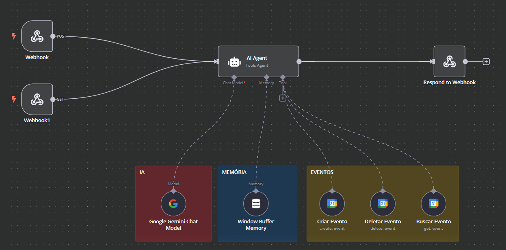

<h1 align="center">
  
  <br>Sistema de Gestão de Clientes para CT CONTAB
</h1>


<!-- 
---

<br>
<p align="left">
  <video height="500" controls>
    <source src="src/videos/meu-video.mp4" type="video/mp4">
    Seu navegador não suporta o elemento de vídeo.
  </video>
  <br>
</p> -->

---

> **Installation and Configuration 💻**

1. ***Clone the Repository:***
   ```bash
   git clone https://github.com/victormoreiraofc/client-manager.git

2. ***Open the Project in NetBeans:***
   - Open [NetBeans IDE](https://netbeans.apache.org/front/main/download/nb25/).
   - Select "Open Project" and navigate to the cloned repository directory.
   - Open the project in NetBeans.

3. ***Database Configuration:***
   - Make sure you have [MySQL Workbanch 8.0](https://dev.mysql.com/downloads/workbench/) installed.
   - Copy the code from the [#database](https://github.com/victormoreiraofc/client-manager/blob/main/database) file and paste it into the query and click on the lightning bolt to execute it.
   - Update and the database will be implemented.

4. ***Dependencies:***
   - Access [Google Cloud](https://console.cloud.google.com/) to create the necessary credentials and APIs.

5. ***Running the Project:***
   - After configuration, run the project directly in NetBeans by clicking on the blue arrow.
   
> [!WARNING]
> You will need to create your N8N application to register new events in the calendar.

---

> [!TIP]
> Follow the N8N workflow model to make event registration work.

<br>
<p align="left">
  
  <br>
</p>

---

> **Official Developer Team ✨**

Thanks goes to these wonderful people ([emoji key](https://allcontributors.org/docs/en/emoji-key)):

<!-- ALL-CONTRIBUTORS-LIST:START - Do not remove or modify this section -->
<!-- prettier-ignore-start -->
<!-- markdownlint-disable -->
<table>
  <tr>
    <td align="center">
      <a href="https://github.com/victormoreiraofc">
        <br>
        <sub>
          <b>Victor Moreira</b>
        </sub>
      </a>
      <br />
        <a href="https://github.com/victormoreiraofc/client-manager/" title="Project Management">📆</a>
        <a href="https://github.com/victormoreiraofc/client-manager/commits/main/" title="Code">💻</a>
        <a href="https://github.com/victormoreiraofc/client-manager/blob/main/README.md" title="Documentation">📖</a>
        <a href="https://github.com/victormoreiraofc/client-manager/tree/main/src/images" title="Design">🎨</a>
        <a href="https://github.com/victormoreiraofc/client-manager/" title="Ideas & Planning">🤔</a>
        <a href="https://github.com/victormoreiraofc/client-manager/" title="Testing">⚠</a>
    </td>
    <td align="center">
      <a href="https://github.com/Mateus-Ebenezer">
        <br>
        <sub>
          <b>Mateus Ebenezer</b>
        </sub>
      </a>
      <br />
        <a href="https://github.com/victormoreiraofc/client-manager/commits/main/" title="Code">💻</a>
        <a href="https://github.com/victormoreiraofc/client-manager/" title="Video">📹</a>
    </td>
    <td align="center">
      <a href="https://github.com/GiovaneRocca03">
        <br>
        <sub>
          <b>Giovane Rocca</b>
        </sub>
      </a>
      <br />
        <a href="https://github.com/victormoreiraofc/client-manager/commits/main/" title="Code">💻</a>
        <a href="https://github.com/victormoreiraofc/client-manager/" title="Video">📹</a>
    </td>
    <td align="center">
      <a href="https://github.com/RuanAlvesz">
        <br>
        <sub>
          <b>Ruan Alves</b>
        </sub>
      </a>
      <br />
        <a href="https://github.com/victormoreiraofc/client-manager/commits/main/" title="Code">💻</a>
        <a href="https://github.com/victormoreiraofc/client-manager/" title="Video">📹</a>
    </td>
    <td align="center">
      <a href="https://github.com/PamellaCorrea">
        <br>
        <sub>
          <b>Pamella Correa</b>
        </sub>
      </a>
      <br />
        <a href="https://github.com/victormoreiraofc/client-manager/commits/main/" title="Code">💻</a>
        <a href="https://github.com/victormoreiraofc/client-manager/blob/main/README.md" title="Documentation">📖</a>
      <a href="https://github.com/victormoreiraofc/client-manager/" title="Testing">⚠</a>
    </td>
    <td align="center">
      <a href="https://github.com/Ingenzin">
        <br>
        <sub>
          <b>Lucas Santos</b>
        </sub>
      </a>
      <br />
        <a href="https://github.com/victormoreiraofc/client-manager/commits/main/" title="Code">💻</a>
        <a href="https://github.com/victormoreiraofc/client-manager/" title="Video">📹</a>
    </td>
  </tr>
</table>

<!-- markdownlint-restore -->
<!-- prettier-ignore-end -->

<!-- ALL-CONTRIBUTORS-LIST:END -->

This project follows the [all-contributors](https://github.com/all-contributors/all-contributors) specification. Contributions of any kind welcome!
